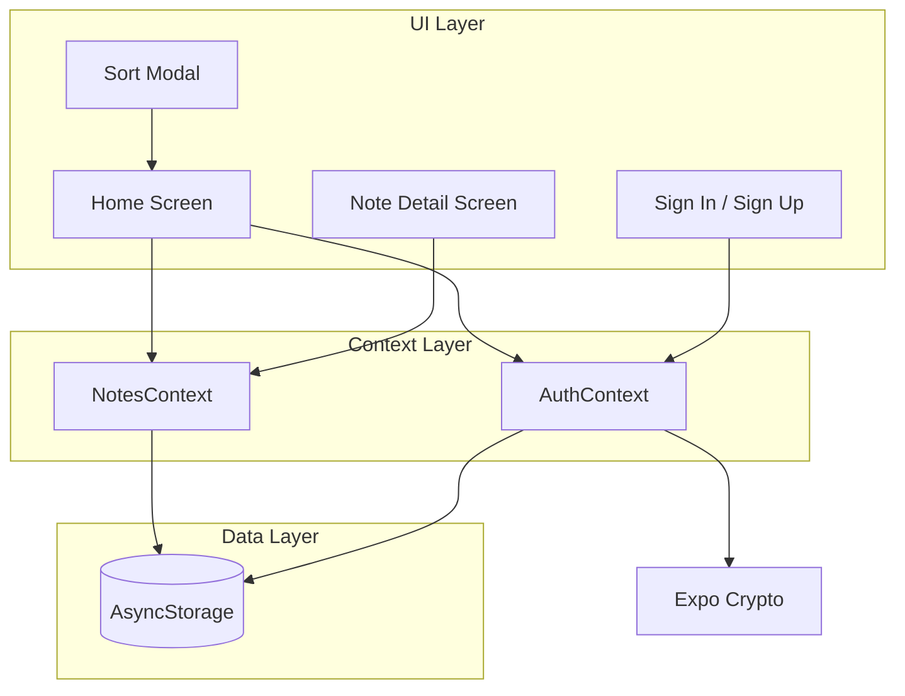

# Notes App

A feature-rich, local-first Notes Application built with Expo and React Native. This application allows users to securely create, manage, and organize their notes with support for images, search, and sorting.

## Features

-   **Secure Local Authentication**: User accounts are created and authenticated locally on the device.
-   **Rich Note Management**: Create, edit, and delete notes with titles, bodies, and image attachments.
-   **Advanced Organization**:
    -   **Search**: Filter notes instantly by title or content.
    -   **Sort**: Organize notes by "Last Updated" or "Title" (A-Z/Z-A).
-   **Persistent Storage**: All data is stored locally on the device, ensuring privacy and offline access.
-   **Modern UI**: Built with a clean, responsive design using standard React Native components.

## Architecture

The application follows a component-based architecture powered by React Context for state management and AsyncStorage for persistence.



## Authentication

Authentication is handled entirely locally on the device, prioritizing user privacy and data ownership.

-   **Mechanism**: The app uses a username/password-based system.
-   **Security**: Passwords are **never** stored in plain text.
    -   When a user signs up, their password is hashed using **SHA-256** via `expo-crypto`.
    -   The hash is stored in `AsyncStorage` with the key `user:{username}`.
-   **Session Management**:
    -   Upon successful login, a session token (username) is stored in `AsyncStorage`.
    -   The app checks for this session on launch to automatically log the user in.
-   **Data Isolation**: Notes are associated with the logged-in user's ID, ensuring that users only see their own data.

## Setup Instructions

1.  **Install Dependencies**
    ```bash
    pnpm install
    ```

2.  **Start the Application**
    ```bash
    pnpm start
    ```

## Libraries Used

-   **Core**: `expo`, `react`, `react-native`, `expo-router`
-   **Storage**: `@react-native-async-storage/async-storage`, `expo-secure-store`
-   **Utilities**: `expo-crypto`, `react-native-uuid`, `expo-file-system`
-   **UI/Media**: `@expo/vector-icons`, `expo-image-picker`, `expo-image`
-   **Navigation**: `@react-navigation/native`, `@react-navigation/bottom-tabs`
